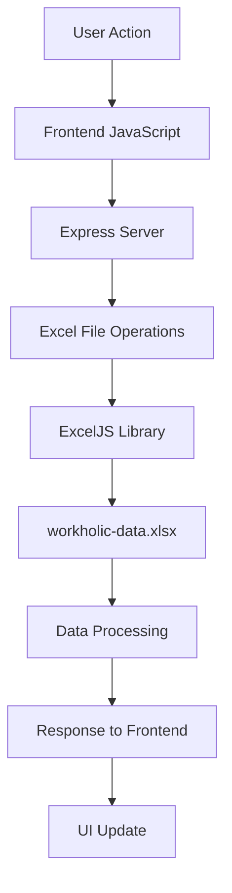

# WorkoHolic - Employee Attendance & Task Tracking System

A comprehensive web-based employee attendance tracking, task management, and leaderboard system built with Python Flask and Excel data storage, optimized for PythonAnywhere hosting.

## 📋 Table of Contents

- [Overview](#overview)
- [Features](#features)
- [Project Structure](#project-structure)
- [Data Handling System](#data-handling-system)
- [Installation & Setup](#installation--setup)
- [Usage](#usage)
- [API Endpoints](#api-endpoints)
- [User Roles](#user-roles)
- [Schedule Management](#schedule-management)
- [Points System](#points-system)
- [Technical Details](#technical-details)
- [Contributing](#contributing)

## 🎯 Overview

WorkoHolic is a modern employee management system that provides:

- **Real-time attendance tracking** with clock in/out functionality
- **Break management** with start/end tracking
- **Task assignment and tracking** with point-based scoring
- **Leaderboard system** to gamify employee performance
- **Admin dashboard** for comprehensive user and attendance management
- **Excel-based data storage** for easy data portability and backup
- **Responsive design** with modern UI/UX

## ✨ Features

### Employee Features
- 🕐 **Clock In/Out System** - Track daily work hours
- ☕ **Break Management** - Start and end break sessions
- 📊 **Live Timers** - Real-time work and break duration tracking
- 📅 **Attendance Calendar** - Visual calendar with attendance status
- 📈 **Personal Dashboard** - View attendance history and performance
- 🏆 **Leaderboard** - See rankings and points earned
- ⏰ **Schedule Display** - View today's work schedule

### Admin Features
- 👥 **User Management** - Create, edit, and delete users
- 📊 **Attendance Overview** - View all employee attendance records
- 🎯 **Task Management** - Assign and track employee tasks
- 📈 **Full Leaderboard** - Complete performance rankings
- 📤 **Excel Export** - Export attendance data to Excel
- 🔍 **Advanced Filtering** - Filter by date and employee

## 📁 Project Structure

```
WorkoHolic/
├── 📄 app.py                           # Main Flask application
├── 📄 wsgi.py                          # WSGI configuration for PythonAnywhere
├── 📄 requirements.txt                 # Python dependencies
├── 📄 README.md                        # Project documentation
├── 📄 PYTHONANYWHERE_DEPLOYMENT.md     # Deployment guide
├── 📁 data/
│   └── workholic-data.xlsx             # Excel database
├── 📁 templates/                       # Flask HTML templates
│   ├── login.html                      # Login page
│   ├── admin.html                      # Admin dashboard
│   └── employee.html                   # Employee dashboard
└── 📁 static/                          # Static files (CSS, JS, images)
    ├── login.js                        # Login functionality
    ├── admin.js                        # Admin functionality
    ├── employee.js                     # Employee functionality
    ├── style.css                       # Custom styles
    └── logo.jpg                        # Company logo
```

## 🗄️ Data Handling System

### Excel Database Structure

The system uses a single Excel file (`data/workholic-data.xlsx`) with three main sheets:

#### 1. **Employees Sheet**
| Column | Description | Example |
|--------|-------------|---------|
| Email | Employee email (unique identifier) | `john@company.com` |
| Name | Full name | `John Doe` |
| Role | User role | `employee` or `admin` |
| Schedule | Work schedule type | `general`, `shreyas`, `srushti`, `vinay` |
| Password | Encrypted password | `hashed_password` |

#### 2. **Attendance Sheet**
| Column | Description | Example |
|--------|-------------|---------|
| Email | Employee email | `john@company.com` |
| Date | Attendance date | `2024-01-15` |
| Clock In | Clock in timestamp | `2024-01-15T09:30:00.000Z` |
| Clock Out | Clock out timestamp | `2024-01-15T18:00:00.000Z` |
| Breaks | JSON array of break sessions | `[{"start":"12:00","end":"13:00"}]` |
| Status | Attendance status | `FD` (Full Day), `HD` (Half Day), `A` (Absent) |

#### 3. **Leaderboard Sheet**
| Column | Description | Example |
|--------|-------------|---------|
| Email | Employee email | `john@company.com` |
| Name | Employee name | `John Doe` |
| Total Points | Total accumulated points | `150` |
| Attendance Points | Points from attendance | `80` |
| Small Tasks | Number of small tasks | `10` |
| Regular Tasks | Number of regular tasks | `5` |
| Big Tasks | Number of big tasks | `2` |

### Data Flow Architecture



### Excel Operations

The system uses **ExcelJS** library for Excel file operations:

- **Read Operations**: Load data from Excel sheets
- **Write Operations**: Update Excel with new data
- **Retry Logic**: Handle file locking issues
- **Data Validation**: Ensure data integrity
- **Backup Strategy**: Automatic data backup

## 🚀 Installation & Setup

### Prerequisites
- Python 3.10 or higher
- pip package manager

### Local Development

1. **Clone the repository**
   ```bash
   git clone <repository-url>
   cd WorkoHolic
   ```

2. **Install dependencies**
   ```bash
   pip install -r requirements.txt
   ```

3. **Run the application**
   ```bash
   python app.py
   ```

4. **Access the application**
   - Open browser and navigate to `http://localhost:5000`
   - The system will automatically create the Excel database on first run

### PythonAnywhere Deployment

For production deployment on PythonAnywhere, see the detailed guide in [PYTHONANYWHERE_DEPLOYMENT.md](PYTHONANYWHERE_DEPLOYMENT.md).

### Default Admin Account
- **Email**: `admin@workholic.in`
- **Password**: `admin123`

## 💻 Usage

### For Employees

1. **Login** with your email and password
2. **Clock In** when you start work
3. **Take Breaks** using the break button
4. **Clock Out** when you finish work
5. **View** your attendance history and leaderboard position

### For Administrators

1. **Login** with admin credentials
2. **Manage Users** - Add, edit, or remove employees
3. **Assign Tasks** - Give points for completed tasks
4. **View Attendance** - Monitor employee attendance
5. **Export Data** - Download attendance reports

## 🔌 API Endpoints

### Authentication
- `POST /api/login` - User login
- `POST /api/logout` - User logout
- `GET /api/user` - Get current user info

### Employee Operations
- `POST /api/clock-action` - Clock in/out, break actions
- `GET /api/attendance/today` - Get today's attendance
- `GET /api/attendance/history` - Get attendance history
- `GET /api/schedule/today` - Get today's schedule
- `GET /api/leaderboard` - Get leaderboard data

### Admin Operations
- `GET /api/admin/employees` - Get employee list
- `GET /api/admin/users` - Get all users
- `POST /api/admin/users/create` - Create new user
- `POST /api/admin/users/update` - Update user
- `POST /api/admin/users/delete` - Delete user
- `GET /api/admin/attendance` - Get all attendance records
- `POST /api/admin/update-tasks` - Update task points
- `GET /api/admin/export-excel` - Export attendance data

## 👥 User Roles

### Employee Role
- Clock in/out functionality
- Break management
- View personal attendance
- View leaderboard
- Access to personal dashboard

### Admin Role
- All employee features
- User management (CRUD operations)
- Task assignment and tracking
- Attendance overview and filtering
- Excel data export
- Full leaderboard access

## ⏰ Schedule Management

The system supports multiple work schedules:

### General Schedule
- **Weekdays**: 10:30 AM - 7:00 PM (60 min break)
- **Saturdays**: 10:00 AM - 1:00 PM (15 min break)
- **Working Saturdays**: 1st and 3rd Saturday of each month

### Custom Schedules
- **Shreyas**: 4:30 PM - 7:00 PM (15 min break), Friday: 12:00 PM - 6:00 PM (45 min break)
- **Srushti**: 10:30 AM - 4:30 PM (45 min break), Saturday: 10:00 AM - 1:00 PM
- **Vinay**: 10:30 AM - 9:00 PM (60 min break), Saturday: 10:00 AM - 1:00 PM

### Attendance Status Calculation
- **FD (Full Day)**: Complete work day with proper hours
- **HD (Half Day)**: Partial work day or late arrival
- **A (Absent)**: No clock in recorded
- **H (Holiday)**: Company holiday

## 🏆 Points System

### Attendance Points
- **Full Day (FD)**: +2 points
- **Half Day (HD)**: +1 point
- **Absent (A)**: -1 point

### Task Points
- **Small Tasks**: +1 point each
- **Regular Tasks**: +2 points each
- **Big Tasks**: +3 points each

### Leaderboard Calculation
```
Total Points = Attendance Points + (Small Tasks × 1) + (Regular Tasks × 2) + (Big Tasks × 3)
```

## 🛠️ Technical Details

### Technology Stack
- **Backend**: Python Flask
- **Frontend**: HTML5, CSS3, JavaScript (ES6+)
- **Styling**: Tailwind CSS, Custom CSS
- **Database**: Excel files (openpyxl library)
- **Session Management**: Flask-Session
- **Hosting**: PythonAnywhere compatible
- **Build Tool**: Vite (for React components)

### Key Dependencies
```txt
Flask==2.3.3
Flask-CORS==4.0.0
openpyxl==3.1.2
Werkzeug==2.3.7
```

### Security Features
- Session-based authentication
- Password protection for admin functions
- Input validation and sanitization
- CORS configuration for API security

### Performance Optimizations
- Excel file retry logic for concurrent access
- Efficient data loading and caching
- Responsive design for mobile devices
- Optimized database queries

### Error Handling
- Comprehensive error logging
- User-friendly error messages
- Graceful fallbacks for failed operations
- Network error handling

## 🔧 Configuration

### Environment Variables
The system uses default configurations that can be modified in `server.js`:

```javascript
const PORT = 3001;
const EXCEL_FILE = './data/workholic-data.xlsx';
```

### Excel File Configuration
- **Location**: `./data/workholic-data.xlsx`
- **Auto-creation**: Yes (on first run)
- **Backup**: Manual (recommended)
- **Concurrent Access**: Handled with retry logic

## 📊 Data Export

### Excel Export Features
- **Format**: .xlsx (Excel format)
- **Data**: Complete attendance records
- **Columns**: Employee name, email, date, clock in/out, status, break duration
- **Filtering**: Date and employee-based filtering
- **Styling**: Professional formatting with headers

## 🚀 Future Enhancements

### Planned Features
- [ ] React-based frontend migration
- [ ] Real-time notifications
- [ ] Mobile app development
- [ ] Advanced reporting and analytics
- [ ] Integration with HR systems
- [ ] Multi-company support
- [ ] Advanced scheduling options
- [ ] Email notifications
- [ ] API rate limiting
- [ ] Database migration (PostgreSQL/MySQL)

## 🤝 Contributing

1. Fork the repository
2. Create a feature branch (`git checkout -b feature/amazing-feature`)
3. Commit your changes (`git commit -m 'Add amazing feature'`)
4. Push to the branch (`git push origin feature/amazing-feature`)
5. Open a Pull Request

## 📝 License

This project is licensed under the MIT License - see the [LICENSE](LICENSE) file for details.

## 📞 Support

For support and questions:
- Create an issue in the repository
- Contact the development team
- Check the documentation for common solutions

---

**WorkoHolic** - Making work tracking simple and engaging! 🚀
